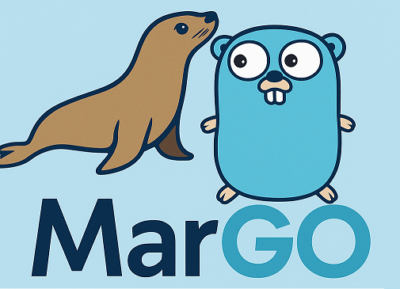

<p align="center">
  
</p>

# MarGO

Generate Go structs, CRUD methods, and custom-query functions from MariaDB
schemas. Use the CLI or call MarGO from Go, with optional SQL migrations before
generation. Generated code supports contexts and transactions and has no MarGO
runtime dependency.

**All generated column fields are strings.** SQL `NULL` becomes `""` on read,
so generated values do not distinguish NULL from an empty string.

Requires **Go 1.27.1 or newer**. Tested with **MariaDB 12.3.3**; MySQL compatibility
has not been verified.

[Quick start](#quick-start) · [Go package](#go-package) · [Migrations](#migrations) ·
[Generated code](#using-generated-code) · [Custom SQL](#custom-sql) ·
[CLI reference](#cli-reference)

## Quick start

Install the CLI:

```bash
go install github.com/rah-0/margo/cmd/margo@latest
```

From your application's Go module, generate code for an existing database.
This example uses a database named `app`; set `DB_PASSWORD` to its user's password:

```bash
margo \
  -dbUser=app \
  -dbPassword="$DB_PASSWORD" \
  -dbName=app \
  -dbIp=127.0.0.1 \
  -outputPath=./generated
```

The output directory must be inside a Go module. For a new project, initialize
one with `go mod init example.com/app`. MarGO creates the output directory if
needed.

Two optional flags extend this command:

- `-migrationsPath=./migrations` creates the database if missing and applies SQL
  migrations before generating code.
- `-queriesPath=./queries` adds functions for your custom SQL queries.

Omit `-outputPath` to run migrations alone. Custom queries require an output
path. Without any of these paths, MarGO exits successfully without doing work.

For an `app` database containing a `users` table, the output is:

```text
generated/
├── errs/
│   └── errors.go
└── App/
    ├── queries.go
    └── Users/
        └── entity.go
```

Each table gets its own package. Database, table, and column names become Go
identifiers: `app` → `App`, `user_profiles` → `UserProfiles`,
`last_update` → `LastUpdate`.

Regeneration overwrites generated files; keep application code separate.
It does not remove obsolete generated files. A generation failure may leave
partial output. Concurrent runs should use separate output directories.

## Go package

Call `runner.Run` to generate code, apply migrations, or do both. Your application
needs neither a MarGO executable nor a Go toolchain at runtime. Generation still
needs an enclosing `go.mod`; migrations alone do not.

### Generate code

Provide connection settings and an output path. MarGO opens and closes the
database connections; the port defaults to `3306`.

```go
import (
    "context"

    "github.com/rah-0/margo/runner"
    "github.com/rah-0/margo/structs"
)

func generate(ctx context.Context, password string) error {
    return runner.Run(ctx, runner.Options{
        Connection: &structs.ConnectionOptions{
            User:     "app",
            Password: password,
            Host:     "127.0.0.1",
            Database: "app",
        },
        OutputPath:  "./generated",
        QueriesPath: "./queries", // Omit when no custom queries are needed.
    })
}
```

### Apply migrations

Using your connection settings, migrate without generating output:

```go
err := runner.Run(ctx, runner.Options{
    Connection:     connection,
    MigrationsPath: "./migrations",
})
```

MarGO creates the configured database if it is missing. To generate code from
the migrated schema, add output and optional query paths:

```go
err := runner.Run(ctx, runner.Options{
    Connection:     connection,
    MigrationsPath: "./migrations",
    OutputPath:     "./generated",
    QueriesPath:    "./queries",
})
```

### Use an existing pool

Pass your application's `*sql.DB` through `DB`:

```go
err := runner.Run(ctx, runner.Options{
    DB:             database,
    MigrationsPath: "./migrations",
    OutputPath:     "./generated",
})
```

You remain responsible for closing the pool. Every connection must select the
same existing database. For migrations, configure `multiStatements=true`, enable
autocommit, and start without an open transaction. Use `Connection` when you
need MarGO to create a missing database.

### Embed migrations in an application

Extract embedded SQL to a temporary directory and pass it as `MigrationsPath`:

```go
import (
    "context"
    "embed"
    "io/fs"
    "os"

    "github.com/rah-0/margo/runner"
    "github.com/rah-0/margo/structs"
)

//go:embed migrations/*.sql
var migrationFiles embed.FS

func migrateEmbedded(ctx context.Context, connection *structs.ConnectionOptions) error {
    source, err := fs.Sub(migrationFiles, "migrations")
    if err != nil {
        return err
    }
    directory, err := os.MkdirTemp("", "margo-migrations-*")
    if err != nil {
        return err
    }
    defer os.RemoveAll(directory)
    if err := os.CopyFS(directory, source); err != nil {
        return err
    }
    return runner.Run(ctx, runner.Options{
        Connection:     connection,
        MigrationsPath: directory,
    })
}
```

The same extraction pattern works for `QueriesPath`.

## Migrations

Keep migrations in a separate directory, with one SQL file per version:

```text
migrations/
├── 0001_users.sql
└── 0002_email.sql
```

`0001_users.sql`:

```sql
CREATE TABLE IF NOT EXISTS users (
    id BIGINT UNSIGNED NOT NULL PRIMARY KEY,
    name VARCHAR(255) NOT NULL
);
```

`0002_email.sql`:

```sql
ALTER TABLE users
    ADD COLUMN IF NOT EXISTS email VARCHAR(255) NOT NULL DEFAULT '';
```

Add `-migrationsPath=./migrations` to the [quick-start command](#quick-start),
or apply migrations alone:

```bash
margo \
  -dbUser=app \
  -dbPassword="$DB_PASSWORD" \
  -dbName=app \
  -dbIp=127.0.0.1 \
  -migrationsPath=./migrations
```

The database user needs permission to run the migration SQL and, if necessary,
create the database. Migration-only runs work outside a Go module.

### Naming and repeated runs

Use filenames such as `0001_users.sql`: a positive version number, an underscore,
a name, and `.sql`. Names start with a letter or digit and contain ASCII letters,
digits, underscores, or hyphens. Keep files directly inside the migrations
directory.

- Start at `0001` for a fresh database and keep versions consecutive.
- Completed versions are skipped. Add a new file for later changes;
  editing an applied migration does not rerun it.
- Keep the full sequence when provisioning fresh databases.

Migrations move forward only; there are no rollback commands.

### Handling a failed migration

**Write SQL that is safe to retry, including data changes.** MariaDB DDL can
commit implicitly, so a failed migration may leave earlier changes applied.
Inspect the database, make the failed migration safe to retry if necessary,
and rerun. A migration can also run again if its SQL succeeded but recording its
completion failed.

`CREATE TABLE IF NOT EXISTS` only guards creation; it does not update an existing
table's definition. Use a new migration for later schema changes.

Each migration must finish with the target database selected, autocommit enabled,
and any transaction committed or rolled back. Complete
`START TRANSACTION` … `COMMIT` blocks within a file are allowed.

When a migration fails, code generation does not start: existing generated files
stay unchanged, and missing output directories are not created.

## Using generated code

Open a `database/sql` pool with a registered MySQL driver. Initialize the generated
database package once with your application's pool:

```go
import appdb "example.com/app/generated/App"

if err := appdb.SetDB(database); err != nil {
    return err
}
```

Then use the generated table packages:

```go
import (
    "context"
    "fmt"

    users "example.com/app/generated/App/Users"
)

func listUsers(ctx context.Context) error {
    result := users.DBSelectAllCtx(ctx)
    if result.Error != nil {
        return result.Error
    }
    for _, user := range result.Entities {
        fmt.Println(user.Id, user.Name)
    }
    return nil
}
```

### CRUD and field selection

Use field constants with `NewQueryParams()` to choose columns and filters:

```go
user := &users.Entity{Name: "Ada"}
result := user.DBSelectCtx(ctx, users.NewQueryParams().
    WithSelect(users.FieldId, users.FieldName).
    WithWhere(users.FieldName))
```

CRUD operations take values from the entity. Filters compare the selected fields
to those values, joined with `AND`. Use `WithInsert` to omit columns that should
receive database defaults.

| Operation | Behavior |
| --- | --- |
| `entity.DBInsert(params)` | Inserts columns from `WithInsert`; defaults to all columns. |
| `entity.DBUpdate(params)` | Requires both `WithUpdate` and `WithWhere`. |
| `entity.DBDelete(params)` | Deletes rows matching `WithWhere`; defaults to matching all columns. |
| `entity.DBSelect(params)` | Uses `WithSelect` and `WithWhere`; defaults to all columns and no filter. |
| `entity.DBExists(params)` | Requires non-nil params. Selects and filters on all columns unless specified; on a match, replaces the receiver with the selected values and sets `Exists`. |
| `users.DBSelectAll()` | Reads every row and column. |
| `users.DBTruncate()` | Truncates the table. |

Every operation returns a result with an `Error` field; check it before using
the other fields. Reads populate `Entities`, writes populate `Result`
(`sql.Result`), and `DBExists` populates `Exists` while updating the receiver.

### Contexts and transactions

CRUD operations and custom queries have `Ctx`, `Tx`, and `CtxTx` variants:

```go
user.DBInsert(params)
user.DBInsertCtx(ctx, params)
user.DBInsertTx(tx, params)
user.DBInsertCtxTx(ctx, tx, params)
```

Use the database package to begin a transaction, then commit or roll it back:

```go
tx, err := appdb.NewCtxTx(ctx)
if err != nil {
    return err
}
defer tx.Rollback()

user := &users.Entity{Id: "1", Name: "Ada"}
result := user.DBInsertCtxTx(ctx, tx, users.NewQueryParams().
    WithInsert(users.FieldId, users.FieldName))
if result.Error != nil {
    return result.Error
}
return tx.Commit()
```

`NewCtxTxOpts(ctx, opts)` accepts `*sql.TxOptions` for isolation and read-only
settings. `NewTx()` and `NewTxOpts(opts)` are available without a context.

## Custom SQL

Pass `-queriesPath=./queries` and put one query in each `.sql` file directly
inside that directory. Use UpperCamelCase filenames: the filename becomes the
function name, prefixed with `Query` or `Exec`. List columns explicitly;
`SELECT *` is rejected.

For example, `queries/GetUserById.sql`:

```sql
-- Returns: id name email
-- ResultMode: one
-- MapAs: users
SELECT id, name, email
FROM users
WHERE id = ?;
```

`MapAs: users` places the function in the `Users` package and reuses its `Entity`:

```go
result := users.QueryGetUserByIdCtx(ctx,
    users.NewQueryParams().WithParams("1"))
if result.Error != nil {
    return result.Error
}
if result.Exists {
    fmt.Println(result.Entity.Name)
}
```

### SQL tags

Put each tag on its own line. Separate field names with whitespace, **not commas**.

| Tag | Meaning |
| --- | --- |
| `-- Returns: id name` | Required for row results. Lists fields in the exact order of the SQL result columns. |
| `-- ResultMode: many` | `many` (default), `one`, or `exec`; determines how results are read. |
| `-- MapAs: users` | Uses an existing table's entity and package. The table name must match the schema exactly. |
| `-- Params: id` | Optional documentation only; it does not control generated parameters. |

With `MapAs`, each `Returns` name must be an exact column name from the mapped
table. Without it, the function lives in `App/queries.go` and has its own result
and row types. Row field names become Go identifiers, and their values are strings.

| Mode | Function | Result fields |
| --- | --- | --- |
| `many` | `Query<Name>` | `Entities`, `Error` |
| `one` | `Query<Name>` | `Entity`, `Exists`, `Error`; no rows means `Entity=nil`, `Exists=false`. |
| `exec` | `Exec<Name>` | `Result` (`sql.Result`), `Error`; no `Returns` tag needed. |

Design `one` queries to return at most one row: mapped queries reject multiple
rows, while standalone queries read the first row.

SQL containing `?` generates a `*QueryParams` argument. Pass a non-nil
`NewQueryParams().WithParams(...)`, with values in placeholder order. Queries
without `?` have no params argument. Custom functions use the same `Ctx`, `Tx`,
and `CtxTx` suffixes as CRUD methods.

See the [SQL examples](tests/integration/testdata/queries) and
[generated-code usage examples](tests/integration/testdata/generated_runtime_test.go)
for more.

## CLI reference

| Flag | Required | Default | Purpose |
| --- | --- | --- | --- |
| `-dbUser` | Yes | — | Database username. |
| `-dbPassword` | Yes | — | Non-empty database password. |
| `-dbName` | Yes | — | Database to inspect and migrate. |
| `-dbIp` | Yes | — | Database hostname or IP address. |
| `-dbPort` | No | `3306` | Database port. |
| `-outputPath` | No | — | Generate code into this directory inside a Go module. |
| `-queriesPath` | No | — | Directory of custom SQL queries; requires `-outputPath`. |
| `-migrationsPath` | No | — | Directory of numbered SQL migrations. |

Database credentials are required when generation or migrations are requested.
Run `margo -help` to show usage.

From the source checkout, run or build the CLI with:

```bash
go run ./cmd/margo
go build ./cmd/margo
```

For contributing and performance comparisons, see [Testing](tests/README.md)
and [Benchmarks](BENCHMARKS.md).

---

# ☕ Support

Less boilerplate, more time to build. If MarGO made your work easier, buy me a coffee and help fuel what comes next ☕

[](https://www.buymeacoffee.com/rah.0)
